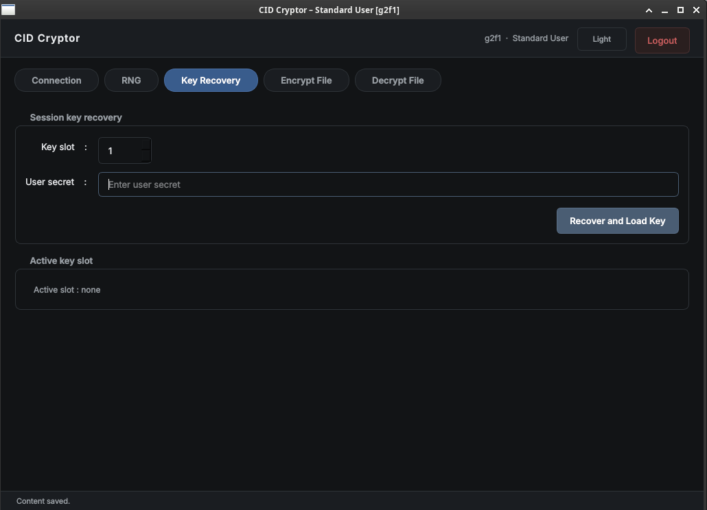

# CID_CRYPTOR

**CID CRYPTOR** is a proprietary file encryption tool consisting of a Qt-based desktop application and a dedicated STM32H753 cryptographic module. The desktop application provides the user interface and communicates with the STM32H753 over USART, while all cryptographic operations are executed on the microcontroller. Consequently, cryptographic keys remain confined to the module and are never exposed to the host computer.

The cryptographic algorithms are implemented in software using , a lightweight, open-source cryptographic library designed for portability, security, and ease of integration. The firmware performs authenticated encryption and decryption using the ChaCha20-Poly1305 AEAD (Authenticated Encryption with Associated Data) algorithm.

By isolating cryptographic processing within the STM32H753, CID_CRYPTOR provides secure key handling while protecting sensitive files. The use of ChaCha20-Poly1305 ensures confidentiality, integrity, and authenticity, allowing any unauthorized modification of an encrypted file to be detected during decryption.

## Connection 
Before using **CID CRYPTOR**, the user must connect the desktop application to the cryptographic module. Once connected, the connection can be verified by sending a **Ping** command to ensure that the device is responding correctly. The application also allows the user to retrieve information about the connected module.

## Random Number Generation

The cryptographic module uses the **True Random Number Generator (TRNG)** integrated into the STM32H753 microcontroller to generate cryptographically secure random data. These random bytes can be used for security-critical operations such as generating **nonces**, **salts**, or seeding a **Pseudo-Random Number Generator (PRNG)**.

The module can generate up to 1MiB of random data.

