# CID CRYPTOR
## Presentation
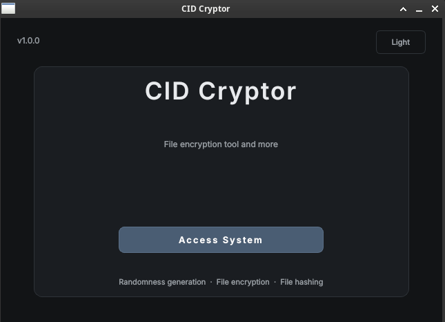

**CID CRYPTOR** is a proprietary file encryption tool consisting of a Qt-based desktop application and a dedicated STM32H753 cryptographic module. The desktop application provides the user interface and communicates with the STM32H753 over USART, while all cryptographic operations are executed on the microcontroller. Consequently, cryptographic keys remain confined to the module and are never exposed to the host computer.

The cryptographic algorithms are implemented in software using , a lightweight, open-source cryptographic library designed for portability, security, and ease of integration. The firmware performs authenticated encryption and decryption using the ChaCha20-Poly1305 AEAD (Authenticated Encryption with Associated Data) algorithm.

By isolating cryptographic processing within the STM32H753, CID_CRYPTOR provides secure key handling while protecting sensitive files. The use of ChaCha20-Poly1305 ensures confidentiality, integrity, and authenticity, allowing any unauthorized modification of an encrypted file to be detected during decryption.

## Standard user features
### Connection 
Before using **CID CRYPTOR**, the user must connect the desktop application to the cryptographic module. Once connected, the connection can be verified by sending a **Ping** command to ensure that the device is responding correctly. The application also allows the user to retrieve information about the connected module.
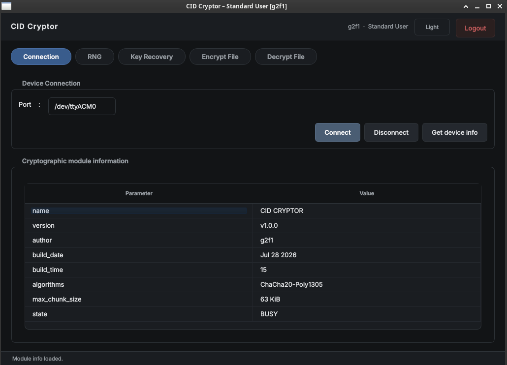

### Random Number Generation

The cryptographic module uses the **True Random Number Generator (TRNG)** integrated into the STM32H753 microcontroller to generate cryptographically secure random data. These random bytes can be used for security-critical operations such as generating **nonces**, **salts**, or seeding a **Pseudo-Random Number Generator (PRNG)**.

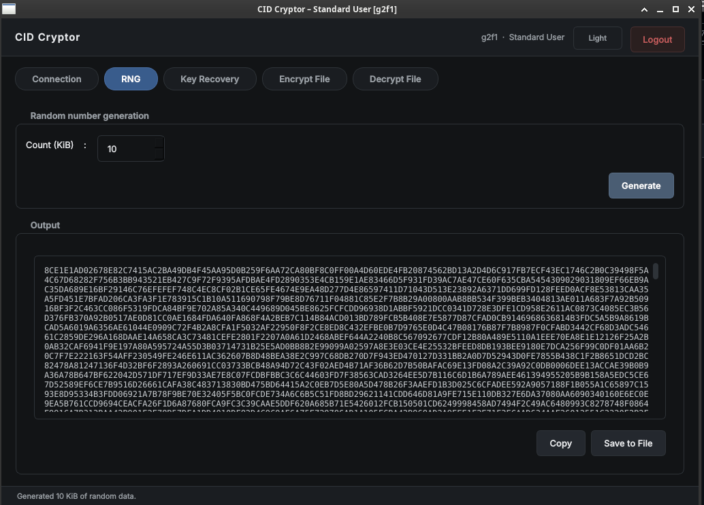

The module can generate up to 1MiB of random data.

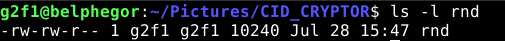

### Key recovery

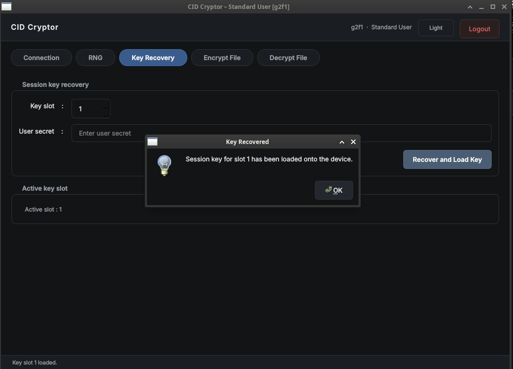

The system uses two types of cryptographic keys:

- **Session keys**, which are used to perform encryption and decryption operations.
- A **master key**, which is used exclusively to encrypt and decrypt the session keys.

The module provides **eight session key slots**, allowing different keys to be assigned to different applications or security domains. Session keys are **never stored in plaintext**; instead, they are encrypted using the master key before being written to non-volatile memory.

Unlike a conventional stored key, the **master key is never permanently stored**. Instead, it is **reconstructed on demand** from three independent components:

1. The microcontroller's unique hardware identifier (**UUID**), stored in the STM32H753's registers.
2. A device secret stored in a protected region of the internal Flash memory.
3. A user-provided password entered during the key recovery process.

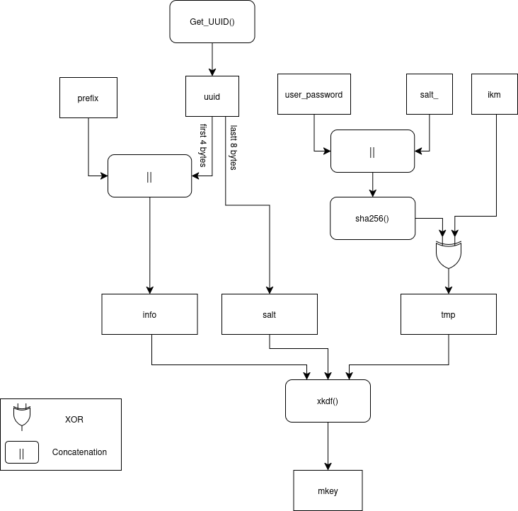

Only when all three components are available can the master key be reconstructed to decrypt a session key. Once recovered, the session key remains in RAM only for a configurable period defined by the **session timeout** parameter. After the timeout expires, the plaintext session key is securely erased from memory and must be recovered again before it can be used.

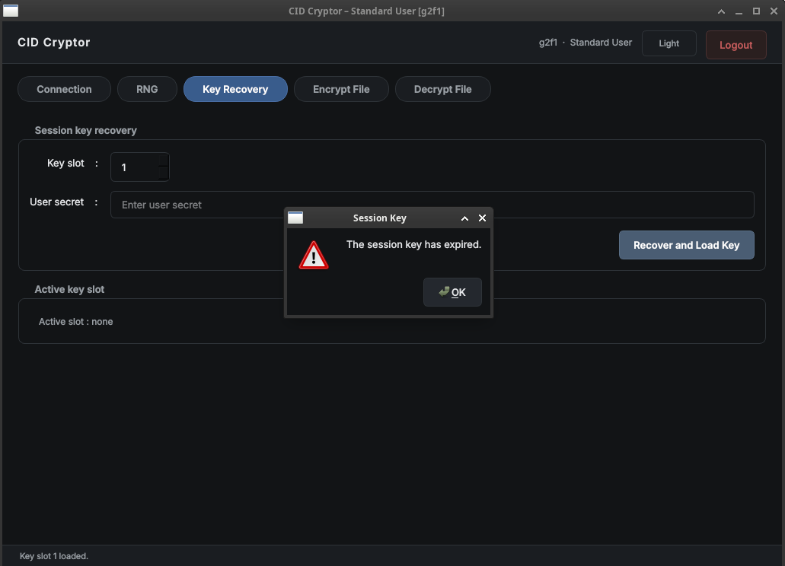

This architecture significantly strengthens the security of the system. An attacker attempting to recover a session key would need to obtain all three components required to reconstruct the master key. In practice, this means the attacker must have **physical access to the cryptographic module**, extract the protected device secret, and know the **user's password**. Without all three components, the encrypted session keys remain unusable.

### Encryption

The Qt desktop application encrypts files by dividing them into **chunks**, which are transmitted sequentially to the STM32H753 cryptographic module for processing. Each chunk is encrypted independently by the module using the selected session key and the **ChaCha20-Poly1305** AEAD algorithm.

The user can customize several encryption parameters, including:

- **Padding size** (enabled or disabled)
- **Additional Authenticated Data (AAD)**
- Other cryptographic settings

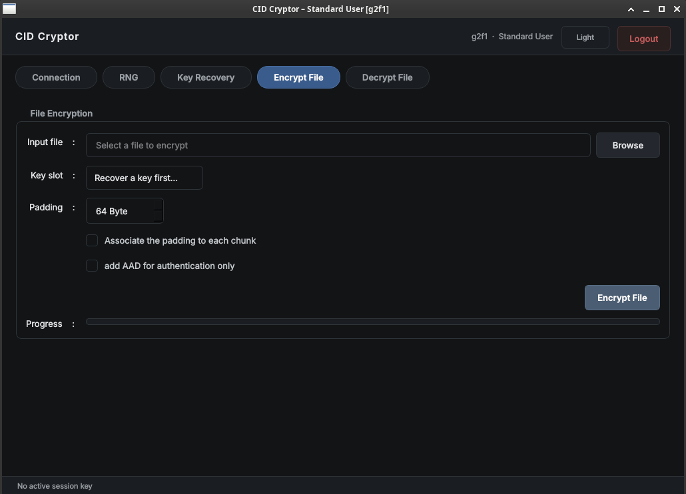

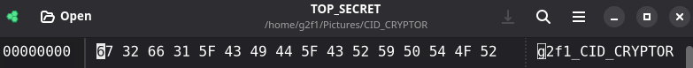

During encryption, the desktop application streams the file to the module chunk by chunk and writes the encrypted output to disk as it is received.

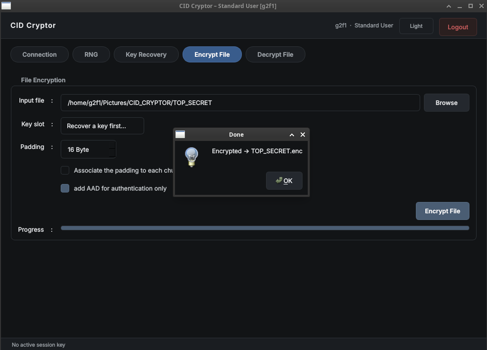

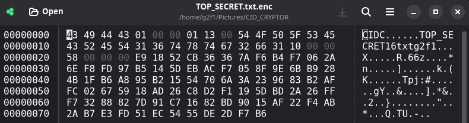

The encrypted data is saved as a new file with the same name as the original, using the **`.enc`** extension.

### Decryption

During decryption, the Qt desktop application reads the encrypted file sequentially. For each encrypted chunk, it extracts the **ciphertext**, **nonce**, and **authentication tag (MAC)** before transmitting them to the STM32H753 cryptographic module.

The module performs the **ChaCha20-Poly1305** decryption and verifies the authentication tag to ensure the integrity and authenticity of the data. If the verification succeeds, the decrypted plaintext is returned to the desktop application and written to the output file. If authentication fails, the operation is aborted, indicating that the encrypted data has been modified, corrupted, or decrypted with an incorrect key.

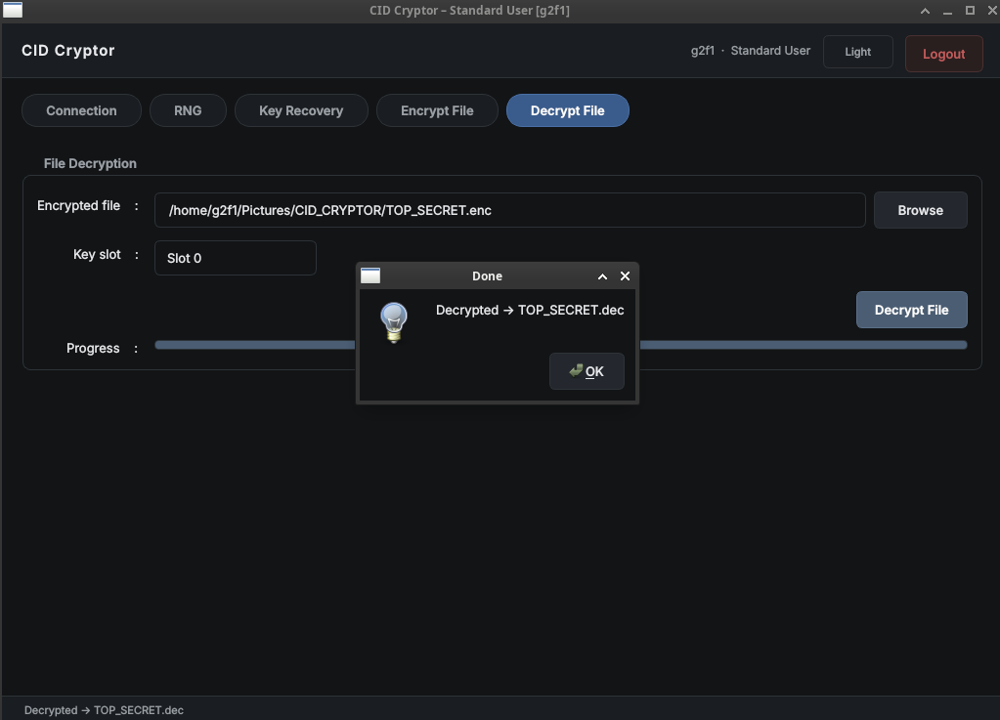

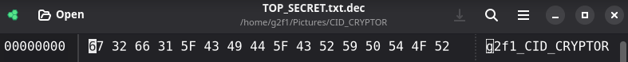

## Super Administrator

The **Super Administrator** is responsible for managing the application and its users. This role has full administrative privileges, including:

- Creating, modifying, and deleting user accounts.
- Assigning and managing user permissions.
- Viewing and managing system activity logs for auditing and security purposes.

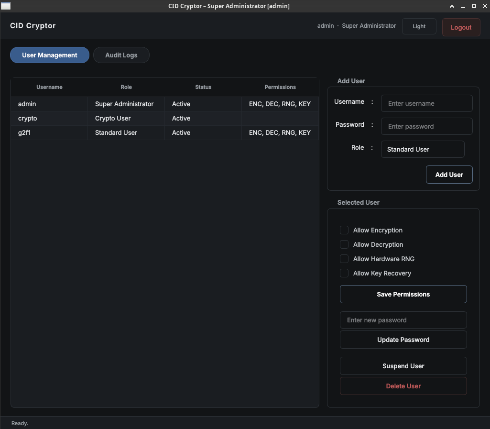

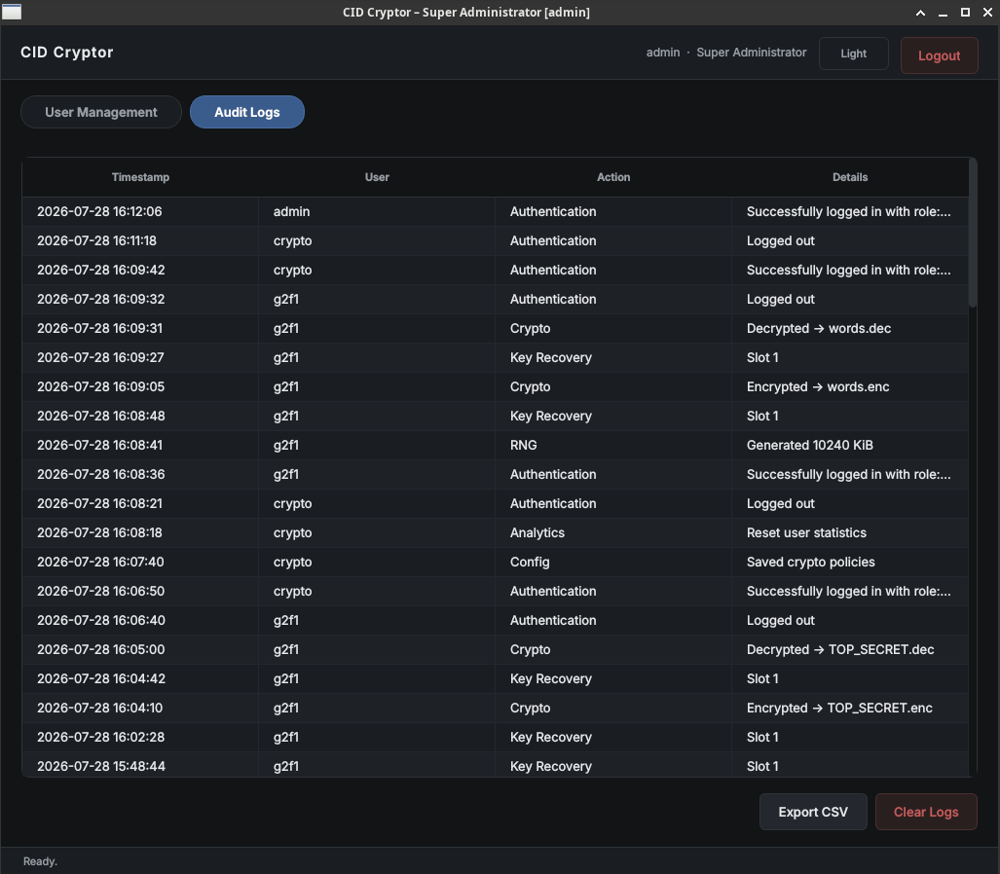

## Crypto Administrator

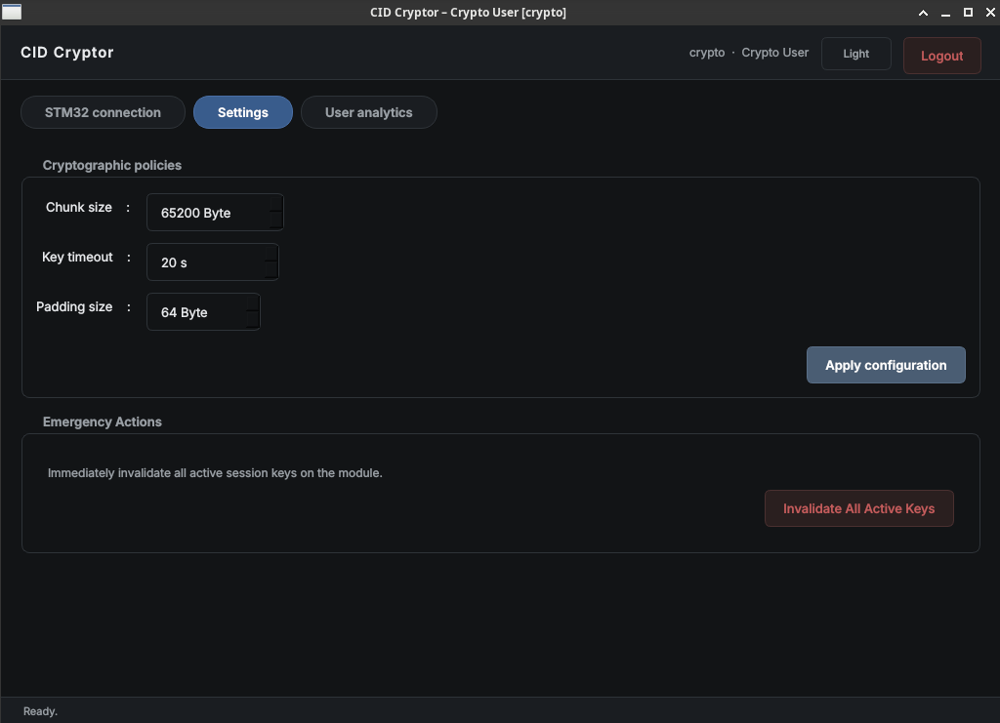

The **Crypto Administrator** is responsible for configuring the cryptographic behavior of the system. This includes adjusting security and performance parameters such as:

- **Session key timeout**
- **Chunk size**
- **Padding size**

In addition to configuring cryptographic settings, the Crypto Administrator has access to usage statistics and analytics, including:

- Number of encrypted and decrypted files.
- Total number of random bytes generated by the cryptographic module.
- Other cryptographic operation metrics.

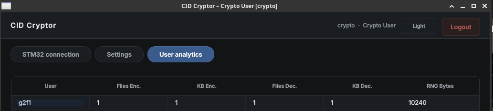

These statistics help monitor system usage and evaluate the performance of the cryptographic module.
